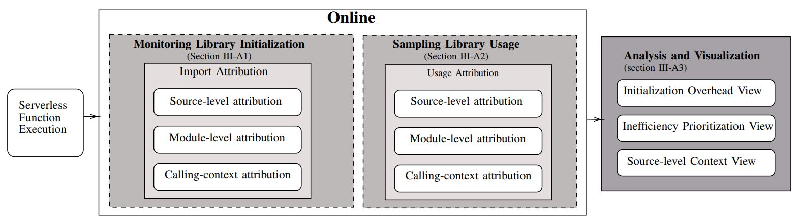

# **InitScope Replication Package**  
*A Python-Based Inefficiency Localization Tool for Serverless Applications*

---



---

## **Abstract**

**Background:** Serverless computing has gained significant popularity due to its scalability, cost efficiency, and abstraction of infrastructure management. However, a major challenge remains in the form of cold-start latency—a delay that occurs when serverless functions are invoked after an idle period, often caused by the initialization of application libraries. Localizing the source of this latency is particularly difficult due to the complex and dynamic nature of serverless applications.  
**Aims:** This research aims to (1) develop and evaluate a developer-oriented tool for precise, code-centric localization of library initialization inefficiencies contributing to cold-start latency, (2) systematically create a taxonomy of recurring antipatterns associated with these initialization inefficiencies, and (3) empirically assess the practical impact and utility of the tool on software development practices through developer studies.  
**Method:** We designed and implemented an inefficiency localization tool, **InitScope** tailored for Python-based serverless applications. The tool leverages dynamic profiling, specifically statistical sampling and call-path profiling techniques, to precisely attribute cold-start inefficiencies at the source-code level. Using this tool, we conducted an extensive manual analysis to systematically identify and classify recurring anti-patterns in library initialization that contribute significantly to cold-start latency. To empirically evaluate its practical effectiveness, we carried out a mixed-method study consisting of a survey of 30 experienced serverless developers, supplemented by follow-up interviews with six participants who used the tool.  
**Results:** The proposed approach, **InitScope**, for localizing cold-start inefficiencies at the source-code level significantly outperformed all baseline methods, achieving 83.3% higher Top-N accuracy. With inefficiencies localized by **InitScope**, our analysis identified four common library initialization antipatterns that significantly contribute to cold-start latency. Moreover, developer evaluations demonstrated the tool’s effectiveness in localizing these inefficiencies, enabling targeted optimizations that substantially reduced latency and memory usage. At the same time, qualitative feedback highlighted enhanced developer awareness and encouraged more performance-conscious coding practices.  
**Conclusions:** The research proposed **InitScope**, for localizing cold-start inefficiencies for serverless applications and provides empirical evidence of prevalent library initialization anti-patterns and demonstrates the value of a profiling-driven, developercentric approach in mitigating cold-start latency. Our findings underscore the importance of incorporating precise, code-level performance insights into serverless application development practices.

---

## **Contents**

### **Directory Structure**
- `profiler/`: Contains the InitScope profiler.
- `visualizer_guide/`: Step-by-step guide on how to use the InitScope visualizer. A live visualizer URL is included.
- `data/`: Contains performance evaluation data files.
- `cdf_plots/`: Includes cumulative distribution plots for initialization and execution latency.
  - Each subfolder represents an application and contains:
    - `initialization_latency.png`
    - `execution_latency.png`
- `applications/`: Contains all evaluated applications in the study.
  - Each subdirectory corresponds to an application:
    - `original/`: The original unoptimized application code.
    - `optimized/`: The optimized application code.
      - `handler.py` or `lambda_function.py`: The entry point for the serverless function.
      - `requirements.txt`: Dependency list for each app.
      - `Dockerfile`: Instructions for building Docker images.
      - Other relevant assets such as models or datasets.
- `qualitative_analysis_dataset/`: Contains the survey questionnaire and full dataset of user study responses, including demographics and qualitative feedback.

---

## **Prerequisites**

Ensure the following are set up before proceeding:
- Access to AWS Console
- AWS services: Lambda, S3, CloudWatch, ECR
- AWS execution role
- Python 3.9
- AWS CLI
- Docker

---

## **Installation**

### **Install Python Dependencies**
```bash
pip install -r ./requirements.txt --platform manylinux2014_x86_64 --target=./$(PACKAGE_DIRNAME) \
--implementation cp --python-version $(PYTHON_VERSION) --only-binary=:all: --upgrade
```

### **Create Deployment Package**
```bash
rm -rf $(ZIP_FILE_NAME)
cd $(PACKAGE_DIRNAME); zip -r ../$(ZIP_FILE_NAME) .; cd ..
zip -r $(ZIP_FILE_NAME) handler.py
```

---

## **Deploy on AWS Lambda**

Use the following command to create the Lambda function. Replace the placeholders with actual values.
```bash
aws lambda create-function --function-name $(LAMBDA_NAME) \
--runtime $(RUNTIME) --role $(ROLE_ARN) --handler $(HANDLER) \
--zip-file fileb://$(ZIP_FILE_NAME) --timeout $(TIMEOUT) --memory-size $(MEMORY_SIZE) \
--environment $(ENV_VARS) --region $(AWS_REGION)
```

---

## **Execute the Application**

Use the command below to invoke the Lambda function in parallel (provide a valid `API_URL`):
```makefile
invoke-par:
	@echo "Invoking in parallel..."
	@for i in {1..$(INVOKE_COUNT)}; do \
		curl --request POST \
			--url $(API_URL) \
			--header 'Content-Type: application/json' & \
	done; wait
```

---

## **InitScope Visualizer**

All profiling data for applications optimized by InitScope can be visualized at:

🔗 [https://initscope.netlify.app/](https://initscope.netlify.app/)

---
